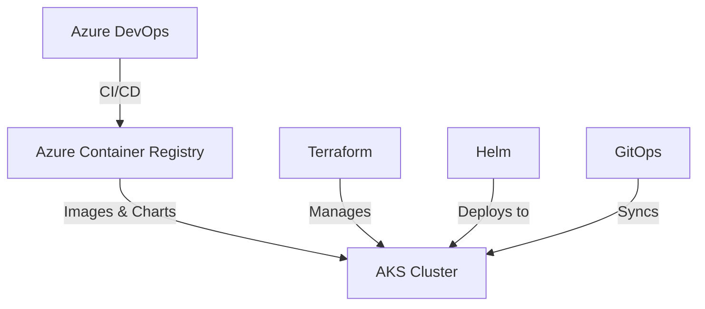

# Infrastructure and Deployment Documentation

## Overview

This repository contains comprehensive documentation for our cloud infrastructure and deployment pipeline using Azure Kubernetes Service (AKS), Helm, and Azure DevOps. The setup follows GitOps principles and infrastructure-as-code practices for reliable, repeatable deployments.

## Architecture Components

### 1. Infrastructure (AKS)
- Azure Kubernetes Service cluster
- Terraform-managed infrastructure
- Network security and RBAC
- Monitoring and logging setup

[Details in AKS Documentation](1.aks.md)

### 2. Application Deployment (Helm)
- Parent-child chart architecture
- Reusable components
- Environment-specific configurations
- Deployment strategies

[Details in Helm Documentation](2.helm.md)

### 3. CI/CD Pipeline (Azure DevOps)
- Automated build and deployment
- GitOps workflow
- Multi-environment promotion
- Security scanning and compliance

[Details in CI/CD Documentation](3.cicd.md)

## Quick Start

1. **Infrastructure Setup**:
   ```bash
   # Initialize Terraform
   terraform init
   
   # Plan and apply AKS infrastructure
   terraform plan -out=tfplan
   terraform apply tfplan
   ```

2. **Helm Deployment**:
   ```bash
   # Package and deploy charts
   helm package helm-charts/common/
   helm package helm-charts/services/*
   helm package helm-charts/parent-chart/
   
   # Install release
   helm upgrade --install my-release parent-chart/ -f values-dev.yaml
   ```

3. **Pipeline Setup**:
   - Configure Azure DevOps project
   - Set up service connections
   - Create variable groups
   - Enable pipeline triggers

## Infrastructure Overview



## Best Practices

1. **Security**:
   - RBAC enabled
   - Network policies
   - Pod security policies
   - Regular security scanning

2. **Scalability**:
   - Autoscaling enabled
   - Resource limits defined
   - Multi-node pools
   - Load balancing

3. **Maintainability**:
   - Infrastructure as Code
   - GitOps workflow
   - Automated deployments
   - Comprehensive monitoring

## Environment Setup

| Environment | Purpose | Promotion Strategy |
|------------|---------|-------------------|
| Dev        | Development & Testing | Automatic |
| QA         | Quality Assurance | Manual Approval |
| Prod       | Production | Manual Approval |

## Documentation Structure

1. [AKS Setup and Configuration](1.aks.md)
   - Cluster provisioning
   - Network configuration
   - Security setup
   - Monitoring integration

2. [Helm Chart Architecture](2.helm.md)
   - Chart structure
   - Deployment configuration
   - Environment management
   - Best practices

3. [CI/CD Implementation](3.cicd.md)
   - Pipeline configuration
   - GitOps workflow
   - Deployment strategy
   - Rollback procedures

## Prerequisites

- Azure Subscription
- Azure DevOps Project
- Terraform >= 1.0.0
- Helm >= 3.0.0
- kubectl
- Azure CLI

## Getting Started

1. Clone this repository
2. Follow the AKS setup guide in [1.aks.md](1.aks.md)
3. Configure Helm charts as described in [2.helm.md](2.helm.md)
4. Set up CI/CD pipelines following [3.cicd.md](3.cicd.md)

## Support and Maintenance

- Regular updates and patches
- Backup and disaster recovery
- Monitoring and alerting
- Performance optimization

## Contributing

1. Fork the repository
2. Create a feature branch
3. Submit a pull request
4. Ensure CI passes
5. Get approval from maintainers

## License

This project is licensed under the MIT License - see the LICENSE file for details.
